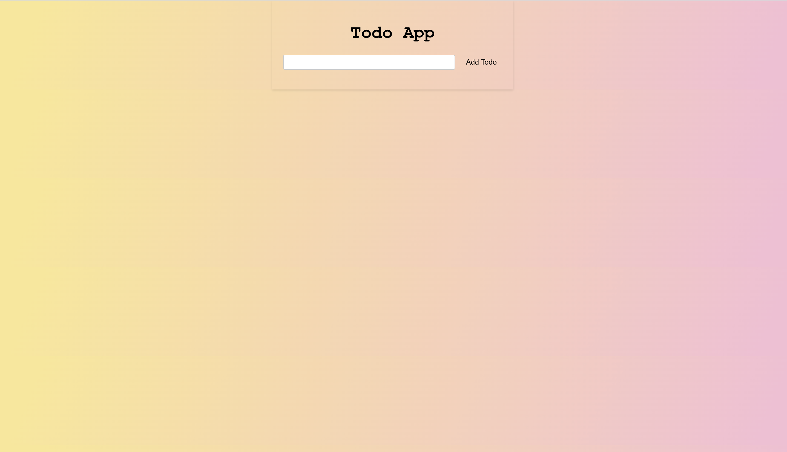
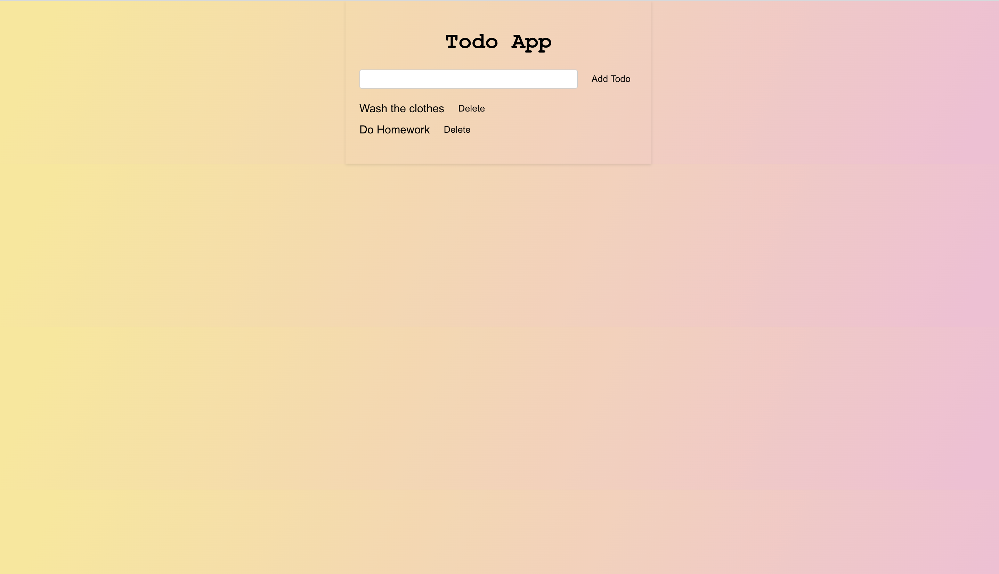

# Todo App


This is a simple to-do app built using React. It allows you to manage and keep track of your tasks in a user-friendly interface.

## Features

- Add new tasks to the to-do list
- Mark tasks as completed
- Delete tasks from the list

## Installation

1. Clone the repository:

   ```bash
   git clone git@github.com:gunash-portfolio/to-do-in-react.git
2. Navigate to the project directory:
    cd todo-app
3. Install the dependencies:
    ```bash 
        npm install

## Usage
1.Start the development server:
```bash
    npm start
```
2.Open the app in your browser:
```arduino
    http://localhost:3000
```
3.You should see the Todo App interface. Enter a task in the input field and click "Add Todo" to add it to the list. To mark a task as completed,click on it.To delete a task,click the "Delete" button next to it.
## Technologies Used
- React
- Javascript
- CSS

## License
This project is licensed under the MIT License.
[](https://opensource.org/licenses/MIT)

